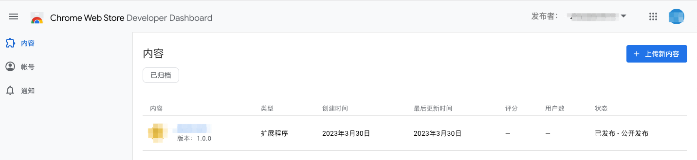

# chrome extensions开发   
Chrome插件开发是一个非常有趣和富有挑战性的领域。它允许开发者在浏览器中创建各种增强功能和实用工具，以及改善用户体验和提高生产力。接下来，我将详细介绍Chrome插件开发的流程以及技术。

### 一.插件结构
一个Chrome插件通常包含以下文件和目录：   
* -manifest.json：描述插件的基本信息和功能。   
* -background.js：运行在插件后台的JavaScript代码。   
* -popup.html和popup.js：用于实现插件弹出窗口的HTML和JavaScript代码。   
* -content.js：用于控制插件在网页中的内容和交互。  
* -图标文件：用于显示插件的图标和标识。  

1. Manifest.json是Chrome插件的配置文件,也是必须的文件，位于插件的根目录下，以下是文件的各种配置信息：
```javascript
{
  // 必须
  "manifest_version": 3, // Chrome扩展平台的最新迭代，目前为3
  "name": "My Extension", // 插件名称 （最多45个字符 展示在：下载框、扩展管理界面、谷歌商城）
  "version": "1.0.1", // 插件版本号
  // 推荐
  "description": "A plain text description", // 插件的描述
  "icons": { // 扩展或主题的图标。128x128的图标；在Chrome网络商店使用。48的图标，在扩展程序管理页面（chrome://extensions）使用。16的图标，作为扩展页面的favicon使用。
    "16": "icon16.png",
    "32": "icon32.png",
    "48": "icon48.png",
    "128": "icon128.png"
  },
  "action": { // 使用chrome.action API来控制扩展在谷歌浏览器工具栏中的图标。
    "default_icon": {        
    "16": "images/icon16.png",   
    "24": "images/icon24.png"
    "32": "images/icon32.png"
    },
    "default_title": "Click Me",
    "default_popup": "popup.html
  },
  "default_locale": "en", // 默认使用的语言. 如果使用. 则必须在_locales文件夹下面包含对应版本的文件
  // 可选
  "author": "developer@example.com",  // 作者
  "automation": {},  // 自动化
  "background": {
    "service_worker": "background.js", // （必填）后台运行的js. 
     "type": ...  //（可选）类型. 可填写module. 使用ES的模块来进行书写.
  },
  "chrome_settings_overrides": {}, // 覆盖chrome的设置
  "chrome_url_overrides": {}, // 覆盖浏览器默认tab页面
  "content_scripts": [{}], // 内容脚本
  "content_security_policy": {},  // 内容安全策略  将使扩展默认情况下更加安全。
  "cross_origin_embedder_policy": {}, // 
  "cross_origin_opener_policy": {},
  "declarative_net_request": {},  // 用于通过指定声明性规则来阻止或修改网络请求(chrome 84以上版本支持)
  "devtools_page": "devtools.html",  // 拓展开发者选项页 前端开发vue、react都会用到插件，能显示对应的组件、数据等。是通过devtools_page来渲染
  "event_rules": [{}],  // 事件规则 改规则可以使用 declarativeWebRequest 阻止或者修改web 请求的规则等
  "export": {},  // 导出  导出字段指示扩展是共享模块，可导出其资源
  "externally_connectable": {},  // 可进行外部链接的匹配 如果未声明externally_connectable，则都可以连接。
  "file_browser_handlers": [],  // 扩展Chrome操作系统文件浏览器 仅在chrome操作系统中有效 需要在permissions中声明
  "file_system_provider_capabilities": {},  // 可以创建文件系统 需要在permissions中声明fileSystemProvide
  "homepage_url": "https://path/to/homepage",  // 插件小图标右键之后，点击插件名称的跳转页面
  "host_permissions": [],  // 主机权限
  "import": [{}],  // 导入 使用import字段声明它们依赖于特定共享模块的资源
  "incognito": "spanning, split, or not_allowed", // 是否可以在无痕模式下启用 三个值：spanning/ split/ not_allowed
  "input_components": [{}],  // 自定义IME  要在 permissions 中添加input权限
  "key": "publicKey",  // 扩展程序的key  通常不需要使用此值。当打包.crx的时候会自动设置的
  "minimum_chrome_version": "107", // 所需的最低版本
  "oauth2": { // 验证用户身份 OAuth2是用于授权的行业标准协议。它提供了一种机制，使用户可以在不共享用户名，密码和其他私有凭据的情况下，向Web和桌面应用程序授予对私有信息的访问权限。
    "client_id": "",
    "scopes": ""
   }, 
  "omnibox": {},  // 允许您在Google Chrome浏览器的地址栏中注册关键字
  "optional_host_permissions": [],  // 请求只在运行时的主机
  "optional_permissions": [],  // 可选权限 在运行时而非安装时请求声明的可选权限，因此用户可以理解为什么需要这些权限，并仅授予必要的权限。
  "options_page": "options.html",  // 插件配置页
  "options_ui": {},  // 插件配置页
  "permissions": [], // 在background中使用到的chrome api，需要进行授权后才可使用
  "requirements": {}, // 指定所需要的特殊技术。目前仅支持"3D"和"plugins"
  "short_name": "Short Name", // 最多12个字符，如果没填则使用 name 字段，通常用于没有足够空间展示全名的地方（展示在应用启动页面、新tab页面）
  "storage": {},  // 存储 与本地和同步存储区不同，托管存储区要求将其结构声明为JSON结构。
  "tts_engine": {}, // 文本语音转换（TTS）引擎
  "version_name": "1.0 beta", // 版本描述
  "web_accessible_resources": [] // 浏览器页面中是无法直接访问插件中的资源的 需要将需要访问的资源列表配置到web_accessible_resources中才能够进行访问
}
```
2. popup.html和popup.js是点击浏览器右上角的插件icon所弹出的弹窗 当焦点失去的时候弹窗会立即关闭，所以popup一般只用来做一些临时性的交互

3. background.js是插件后台运行的JavaScript代码文件。它可以处理插件的后台逻辑和数据，例如：接收和处理插件的各类请求，控制插件的生命周期等。   
4. content_scripts 的作用 是允许我们将我们的脚本以及html注入到浏览器页面，每一个标签页都是一个实例，当标签页创建完成后我们的content_scripts可以访问标签页的dom元素，也可以插入我们自己创建的dom元素，但与标签页原有的js不在同一个作用域所以无法访问原页面的js的变量以及方法   
+ 例： 向页面插入插件页面   
虽然通过content_script能够往页面中插入js来达到在页面添加dom元素的目的，但是每次都通过js创建标签去插入实在是太麻烦了，那我们可以换一种思路来解决这个问题，我们把想要插入的html直接写在一个html的页面，在content_script中创建一个iframe元素，并让iframe的地址指向我们创建的这个html文件
```javascript
window.onload = function () {
   let style = document.createElement('style');
   style.innerHTML = `
    .bk-sidebar-wrp {
      width: 100%;
      height: 100vh;
      background: rgba(0,0,0,.5);
      position: fixed;
      top: 0;
      left: 0;
      z-index: 9999;
      transition: visibility .5s;
      visibility: hidden;
    }
    .bk-sidebar-wrp.visible {
      visibility: visible;
    }
    .bk-sidebar-wrp-content {
      transform: translateX(100%);
      transition: all .5s linear;
      width: 450px;
      height: 100vh;
      background: #fff;
      position: absolute;
      top: 0;
      right: 0;
    }
    .bk-sidebar-wrp-content-visible {
      transform: translateX(0);
    }
  `
   document.head.appendChild(style);
   
   let e = document.createElement('div');
   e.classList.add('bk-sidebar-wrp')
   document.body.appendChild(e)
   
   let iframe = document.createElement('iframe');
   iframe.classList.add('bk-sidebar-wrp-content')
   iframe.src = chrome.runtime.getURL('home.html');
   
   e.appendChild(iframe)
   e.addEventListener('click', toggle)
};
```
随便打开一个标签页就可以看到我们创建的html被插入到了页面中。还有一些我们平时常见的广告屏蔽、页面css定制类的插件就是通过获取页面中的某些css标签进行操作来达到某种目的。


### 二、ChromeAPIs
扩展程序除了能够使用网页和应用可以使用的所有API外，还能使用仅用于 Chrome 浏览器的 API（通常称为 chrome.* API）来更好地与浏览器集成。例如，任何扩展程序或网上应用可以使用标准的 window.open() 方法来打开一个网页，但是如果您想指定网页应该显示在哪个窗口中，您的扩展程序就可以使用仅用于 Chrome 浏览器的 tabs.create 方法，还有浏览器历史、下载和上传文件、操作浏览器标签、读取和写入Cookie等。   
chromeAPI中的方法通常是异步的：它们不等待操作完成就立即返回。如果需要知道某个操作的结果，应该向方法传递一个回调函数。一些API要使用时, 需要先在清单中声明权限   
例: 异步方法   
chrome.tabs.create(object createProperties, function callback)   
例: 声明权限
```javascript
  "permissions": [
    "tabs",
    "bookmarks",
    "storage",
    "favicon",
    "identity"
  ]
```


### 三、页面间的通信
扩展程序中的 HTML 网页通常需要通信。因为一个扩展程序的所有网页在同一个进程中的同一个线程上执行，网页之间可以直接调用函数。要获得扩展程序中的网页，可以使用chrome.extension方法。一旦一个网页引用了扩展程序中的其他网页，第一个网页可以执行其他网页上的函数，并且可以操纵它们的 DOM。（未完）

### 四、加载扩展程序
从 Chrome 网上应用商店下载的扩展程序打包为 .crx 文件，便于发布，但是不便于开发。注意到了这一点，Chrome 浏览器提供了一种方式，可以加载你的工作目录用于测试。现在让我们来试试。
1. 在你的浏览器中访问 chrome://extensions（或者单击多功能框最右边的按钮： The menu's icon is three horizontal bars.打开 Chrome 浏览器菜单，并选择工具(L)菜单下的扩展程序(E)，进入相同的页面）。
2. 确保右上角开发者模式复选框已选中。
3. 单击加载已解压的扩展程序，弹出文件选择对话框。
4. 浏览至您的扩展程序文件所在的目录，并选定。
5. 如果扩展程序有效的话，它将被加载并且立刻处于活动状态！如果无效的话，页面顶部将显示错误消息，请纠正错误再重试。


### 五、发布扩展程序
要发布到Google应用商店的话需要先登录Google账号，然后花5个$注册为开发者，再将你开发好的插件上传即可，后面就是添加所需信息以及等待审核了。
https://chrome.google.com/webstore/devconsole/register [注册开发者地址]


