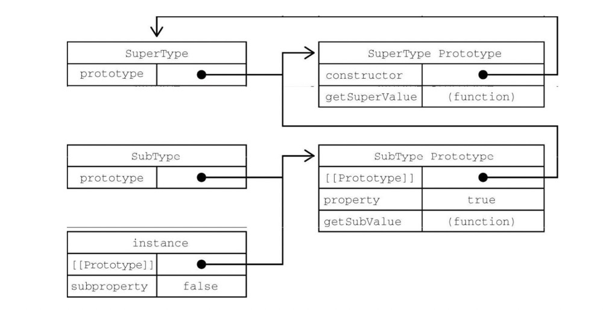

对象的创建以及对象的继承

继承是面向对象编程中讨论最多的话题，很多面向对象的语言都支持两种继承：接口继承和实现继承。前者只继承方法签名，后者继承实际的方法。接口继承在ECMAScript中是不可能的，因为函数没有签名。实现继承是ECMAScript唯一支持的继承方式，而这主要是通过原型链实现的。
原型链： 每个构造函数都有一个原型对象，原型有一个属性指回构造函数，而实例有一个内部指针指向原型。如果原型是另一个类型的实例呢？那就意味着这个原型本身有一个内部指针指向另一个原型，相应地另一个原型也有一个指针指向另一个构造函数。这样就在实例和原型之间构造了一条原型链。这就是原型链的基本构想。
### 创建对象的六种方式
1. Object构造函数创建
```
let person = new Object()
person.name= 'Lisa'
person.age = 25
person.job = 'Software Engineer'
person.sayName = function() {
  console.log(this.name)
}
```
这里创建了一个名为person的对象，添加了三个属性和一个方法
2. 对象字面量
```
let person = {
  name: 'Lisa',
  age: 25,
  job: 'Software Engineer',
  sayName: function() {
    console.log(this.name)
  }
}
```
对象字面量是对象定义的一种简写形式，第一种和第二种方式其实都是一样的，只是写法上的区别不同
3. 工厂模式创建对象
把创建对象的过程封装在函数体内，通过函数的调用直接生成对象。
```
function createObj(name, age, job) {
  let p = new Object()
  p.name = name
  p.age = age
  p.job = job
  p.sayName = function() {
    return this.name
  }
  return p
}
console.log(createObj('Lisa', 25, 'Software Engineer'))
console.log(createObj('Lisa1', 26, 'Software Engineer1'))
```
4. 使用构造函数创建对象
```
 function Person(name, age, job) {
      this.name = name
      this.age = age
      this.job = job
      this.sayName = function() {
        return this.name
      }
    }
let person = new Person('Lisa', 25, 'Software Engineer')
let person2 = new Person('Lisa2', 26, 'Software Engineer2')
```
对比工厂模式有以下区别

没有显式的创建对象   
属性和方法赋值给this对象
没有return
另外，要注意函数名Person的首字母大写了。按照惯例，构造函数名称的首字母都是要大写的，非构造函数则以小写字母开头。这是从面向对象编程语言那里借鉴的，有助于在ECMAScript中区分构造函数和普通函数。毕竟ECMAScript的构造函数就是能创建对象的函数。
5. 原型创建对象模式
```
function Person() {
     Person.prototype.name = 'Lisa'
     Person.prototype.age = 25
     Person.prototype.job = 'Software Engineer'
     Person.prototype.sayHello = function() {
       return this.name
     }
   }
let person1 = new Person()
let person2 = new Person()
person1.name = 'siri'
console.log(person1.name) // siri 来自实例
console.log(person2.name) // Lisa 来自原型
```
6. 混合模式（构造函数+原型模式）
```
   function Person( name, age, job) {
     this.name = name
     this.age = age
     this.job = job
   }
   Person.prototype.name = 'Lisa'
   Person.prototype.sayHi = function() {
     console.log('hi')
   }
   Person.prototype = {
    constructor: Person,
    say() {
      console.log(this.name)
    }
   }
   
let person1 = new Person('Lisa', 25, 'Software Engineer2')
let person2 = new Person('lida', 26, 'Software Engineer')
```
### 对象继承的几种方式
1. 原型链继承
```
function SuperType(){
  this.property = true
}
SuperType.prototype.getSuperValue = function(){
  return this.property
}

function SubType(){
  this.subproperty = false
}
// 继承自SuperType
SubType.prototype = new SuperType();

SubType.prototype.getSubValue = function (){
  return this.subproperty
}

var instance = new SubType()
alert(instance.getSuperValue()) //true
```

这个例子中实现继承的关键，是SubType没有使用默认原型，而是将其替换成了一个新的对象。这个新的对象恰好是SuperType的实例。这样一来，SubType的实例不仅能从SuperType的实例中继承属性和方法，而且还与SuperType的原型挂上了钩,于是instance（通过内部的_proto_）指向SubType.prototype，而SubType.prototype（作为SuperType的实例又通过内部的_proto_）指向SuperType.prototype。注意，getSuperValue()方法还在SuperType.prototype对象上，而property属性则在SubType.prototype上。这是因为getSuperValue()是一个原型方法，而property是一个实例属性。SubType.prototype现在是SuperType的一个实例，因此property才会存储在它上面。还要注意，由于SubType.prototype的constructor属性被重写为指向SuperType，所以instance.constructor也指向SuperType。
原型链虽然是实现继承的强大工具，但它也有问题。主要问题出现在原型中包含引用值的时候。引用值会在所有实例间共享，这也是为什么属性通常会在构造函数中定义而不会定义在原型上的原因。在使用原型实现继承时，原型实际上变成了另一个类型的实例。这意味着原先的实例属性摇身一变成为了原型属性, 下面的例子揭示了这个问题：
```
function SuperType(){
  this.colors = ['red', 'blue', 'green']
}
function SubType() {}
SubType.prototype = new SuperType()

let subType = new SubType()
subType.colors.push('black')
console.log(subType.colors) //['red', 'blue', 'green', 'black']
let subType2 = new SubType()
console.log(subType.colors) //['red', 'blue', 'green', 'black']
```
例子中 SuperType构造函数定义了一个colors属性，值为一个引用类型的数组，每个SuperType实例都会有自己的colors，当SubType通过原型继承SuperType后，SubType.prototype变成了SuperType的一个实例，因而也获得了自己的colors属性，类似于创建了SubType.prototype.colors属性。最终结果是，SubType的所有实例都会共享这个colors属性。这一点通过instance1.colors上的修改也能反映到instance2.colors上就可以看出来
2. 借用构造函数继承（对象伪装或经典继承）
使用call()方法和apply()方法将父类构造函数引入子类构造函数，使用父类的构造函数来增强子类实例，等同于复制父类的实例给子类
```
function SuperType(name) {
  this.name = name
  this.colors = ['red', 'green', 'pink']
}

function SubType(name, age) {
  this.age = age
  SuperType.call(this, name)
}
const subType = new SubType('Lisa', 25)
subType.colors.push('black')
console.log(subType.colors) // ['red', 'green', 'pink', 'black']
const subType2 = new SubType()
console.log(subType2.colors) // ['red', 'green', 'pink']
subType.age // 25
subType.name // Lisa
```
通过使用call()（或apply()）方法，SuperType构造函数在为SubType的实例创建的新对象的上下文中执行了。这相当于新的SubType对象上运行了SuperType()函数中的所有初始化代码。结果就是每个实例都会有自己的colors属性。
缺点：
+ 只能继承构造函数的属性和方法不能继承构造函数的原型属性和方法
+ 无法实现构造函数的复用， 每个子类都有父类实例函数的副本，影响性能，代码会臃肿
3. 组合继承
```
function SuperType(name) {
  this.name = name
  this.colors = ['red', 'pink', 'blue']
}
SuperType.prototype.sayName = function() {
  console.log(this.name)
}

function SubType(name, age) {
  // 继承SuperType属性
  SuperType.call(this, name)
  this.age = age
}
// 继承方法
SubType.prototype = new SuperType()
SubType.prototype.sayAge = function () {
  console.log(this.age)
}

let instance1 = new SubType('Lisa', 25)
instance1.colors.push('black')
console.log(instance1.colors)  // ['red', 'pink', 'blue', 'black']
instance1.sayName()  // Lisa
instance1.sayAge()  // 25
let instance2 = new SubType('lida', 26) // ['red', 'pink', 'blue']
console.log(instance2.colors)
instance2.sayName()  // lida
instance2.sayAge()  // 26
```
缺陷：
父类中的实例属性和方法既存在于子类的实例中，又存在于子类的原型中，不过仅是内存占用，因此，在使用子类创建实例对象时，其原型中会存在两份相同的属性/方法
不过组合继承弥补了原型链和盗用构造函数的不足，是JS中使用最多的继承模式。而且组合继承也保留了instanceof操作符和isPrototypeOf()方法识别合成对象的能力。
4. 原型式继承
创建一个临时构造函数，将传入的对象赋值给这个构造函数的原型，然后返回这个临时类型的一个实例。本质上，object()是对传入的对象执行了一次浅复制。
```
function object(o) {
  function F(){}
  F.prototype = o
  return new F()
}

const person = {
  name: 'Lisa',
  friends: ['Sa', 'Van', 'Court']
}
let person1 = object(person)
person1.name = 'Linda'
person1.friends.push('Greg')
let person2 = object(person)
person2.name = 'Maria'
person2.friends.push('Jie')
console.log(person.friends) // ['Sa', 'Van', 'Court', 'Greg', 'Jie']
```
原型式继承适用于这种情况：你有一个对象，想在它的基础上再创建一个新对象。你需要把这个对象先传给object()，然后再对返回的对象进行适当修改。在这个例子中，person对象定义了另一个对象也应该共享的信息，把它传给object()之后会返回一个新对象。这个新对象的原型是person，意味着它的原型上既有原始值属性又有引用值属性。这也意味着person.friends不仅是person的属性，也会跟person1和person2共享。这里实际上克隆了两个person。
5. 寄生式继承
与原型式继承比较接近的一种继承方式是寄生式继承，寄生式继承背后的思路类似于寄生构造函数和工厂模式：创建一个实现继承的函数，以某种方式增强对象，然后返回这个对象。基本的寄生继承模式如下：
```
function object(o) {
  function F(){}
  F.prototype = o
  return new F()
}
function createAnother(original) {
  let clone = object(original)  // 通过调用一个函数返回新对象
  clone.sayHi = function() {  // 为新对象增加属性
    console.log('hi')
  }
  return clone  // 返回这个新对象
}
let person = {
  name: 'Lisa',
  friends: ['Sa', 'Van', 'Court']
}
let person1 = createAnother(person)
console.log(person1.name)  // Lisa
console.log(person1.friends)  // ['Sa', 'Van', 'Court']
person1.sayHi() // hi
```
这个例子基于person对象返回了一个新对象。新返回的anotherPerson对象具有person的所有属性和方法，还有一个新方法叫sayHi(),寄生式继承同样适合主要关注对象，而不在乎类型和构造函数的场景。object()函数不是寄生式继承所必需的，任何返回新对象的函数都可以在这里使用
注： 寄生式继承同样适合主要关注对象，而不在乎类型和构造函数的场景。object()函数不是寄生式继承所必需的，任何返回新对象的函数都可以在这里使用
6. 寄生式组合继承
组合继承其实也存在效率问题。最主要的效率问题就是父类构造函数始终会被调用两次：一次在是创建子类原型时调用，另一次是在子类构造函数中调用。本质上，子类原型最终是要包含超类对象的所有实例属性，子类构造函数只要在执行时重写自己的原型就行了
重点：通过借用构造函数传递参数和寄生模式实现继承属性，通过原型链的混成形式来继承方法，在函数中用apply或者call引入另一个构造函数
```
// 父类实例属性和原型属性
function SuperType(name) {
  this.name = name
  this.colors = ['red', 'green', 'pink']
}
SuperType.prototype.sayName = function() {
  console.log(this.name)
}
function SubType(name, age) {
  // 借用构造函数传递增强子类实例属性
  SuperType.call(this, name) // 第二次调用SuperType
  this.age = age
}

// 将父类原型指向子类
inheritPrototype(SubType, SuperType);

// 新增子类原型属性
SubType.prototype.sayAge = function() {
  console.log(this.age)
}

function inheritPrototype(SubType, SuperType) {
  let prototype = Object.create(SuperType.prototype)  // 创建对象
  prototype.constructor = SubType  // 增强对象
  SubType.prototype = prototype  // 赋值对象
}

let example1 = new SubType("Lisa", 25);
let example2 = new SubType("Van", 26);
example1.colors.push("yellow") // ['red', 'green', 'pink', 'yellow']
example2.colors.push("black") // ['red', 'green', 'pink', 'black']
```
这个inheritPrototype()函数实现了寄生式组合继承的核心逻辑。这个函数接收两个参数：子类构造函数和父类构造函数。在这个函数内部，第一步是创建父类原型的一个副本。然后，给返回的prototype对象设置constructor属性，解决由于重写原型导致默认constructor丢失的问题。最后将新创建的对象赋值给子类型的原型
寄生式组合继承可以算是引用类型继承的最佳模式。

