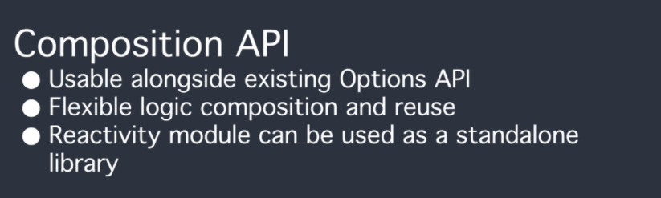

# vue3

## Vite
vite ，是一个基于浏览器原生 ES imports 的开发服务器(开发构建工具)，它做到了本地快速开发启动, 用 vite 文档上的介绍，它具有以下特点：
+ 快速的冷启动，不需要等待打包操作；
+ 即时的热模块更新，替换性能和模块数量的解耦让更新飞起；
+ 真正的按需编译，不再等待整个应用编译完成;
> Vite，一个基于浏览器原生 ES imports 的开发服务器。利用浏览器去解析 imports，在服务器端按需编译返回，完全跳过了打包这个概念，服务器随起随用。同时不仅有 Vue 文件支持，还搞定了热更新，而且热更新的速度不会随着模块增多而变慢。针对生产环境则可以把同一份代码用 rollup 打。虽然现在还比较粗糙，但这个方向我觉得是有潜力的，做得好可以彻底解决改一行代码等半天热更新的问题。

使用 npm：
```coffeescript
# npm 7+，需要加上额外的双短横线
$ npm init vite@latest <project-name> -- --template vue

$ cd <project-name>
$ npm install
$ npm run dev
```
或者 yarn：
```coffeescript
$ yarn create vite <project-name> --template vue
$ cd <project-name>
$ yarn
$ yarn dev
```


## 概览
相比vue2.0有哪些变化  

+ 速度更快
+ 体积减少
+ 更易维护
+ 更接近原生
+ 更易使用

1. 重写了虚拟Dom实现   
  diff算法优化   
```coffeescript
<div>
  <span/>
  <span>{{ msg }}</span>
</div>
```
被编译成:
```coffeescript
import { createVNode as _createVNode, toDisplayString as _toDisplayString, openBlock as _openBlock, createBlock as _createBlock } from "vue"

export function render(_ctx, _cache) {
  return (_openBlock(), _createBlock("div", null, [
    _createVNode("span", null, "static"),
    _createVNode("span", null, _toDisplayString(_ctx.msg), 1 /* TEXT */)
  ]))
}
```

Vue在运行时会生成number（大于0）值的PatchFlag，用作标记,仅带有PatchFlag标记的节点会被真正追踪，无论层级嵌套多深，它的动态节点都直接与Block根节点绑定，无需再去遍历静态节点   
     
  跳过静态节点，只处理动态节点,所以处理的数据量减少，性能得到很大的提升
  把静态节点进行提升，提升到 render 函数外面，这样一来，这个静态节点永远只被创建一次，之后直接在 render 函数中使用就行了。   
2. 事件监听缓存：cacheHandlers
```
<div>
  <span @click="onClick">
    {{msg}}
  </span>
</div>
```
优化前：
```coffeescript
import { toDisplayString as _toDisplayString, createVNode as _createVNode, openBlock as _openBlock, createBlock as _createBlock } from "vue"

export function render(_ctx, _cache) {
  return (_openBlock(), _createBlock("div", null, [
    _createVNode("span", { onClick: _ctx.onClick }, _toDisplayString(_ctx.msg), 9 /* TEXT, PROPS */, ["onClick"])
  ]))
}
```
onClick会被视为PROPS动态绑定，后续替换点击事件时需要进行更新。   
优化后：
```coffeescript
import { toDisplayString as _toDisplayString, createVNode as _createVNode, openBlock as _openBlock, createBlock as _createBlock } from "vue"

export function render(_ctx, _cache) {
  return (_openBlock(), _createBlock("div", null, [
    _createVNode("span", {
      onClick: _cache[1] || (_cache[1] = $event => (_ctx.onClick($event)))
    }, _toDisplayString(_ctx.msg), 1 /* TEXT */)
  ]))
}
```
 会自动生成一个内联函数，这个内联函数里面再去引用当前组件最新的onclick,然后把这个内联函数cache起来，第一次渲染的时候会创建内联函数并且缓存，后续的更新就直接从缓存里面读同一个函数，既然是同一个函数就没有再更新的必要，就变成了一个静态节点
3. SSR速度提高   
当有大量静态的内容时，这些内容会被当做纯字符串推进一个buffer里面，即使存在动态的绑定，会通过模板 插值嵌入进去，这样会比通过虚拟dom来渲染的快很多。vue3.0 当静态文件大到一定量的时候，会用_ceratStaticVNode方法在客户端去生成一个static node, 这些静态node,会被直接innerHtml,就不需要创建对象，然后根据对象渲染

4. tree-shaking   
   
通过webpack的tree-shaking功能，可以将无用模块“剪辑”，仅打包需要的能够tree-shaking
5. compositon Api   
   
与选项API最大的区别的是逻辑的关注点   
选项API这种碎片化使得理解和维护复杂组件变得困难，在处理单个逻辑关注点时，我们必须不断地上下翻找相关代码的选项块。
组合式API将同一个逻辑关注点相关代码收集在一起
```
import { useRouter } from 'vue-router'
import { reactive, onMounted, toRefs } from 'vue'

setup (props) {
  const state = reactive({
    userInfo: {}
  })

  const getUserInfo = async () => {
    state.userInfo = await GET_USER_INFO(props.id)
  }

  onMounted(getUserInfo) // 在 `mounted` 时调用 `getUserInfo`

  return {
    ...toRefs(state),
    goBack,
    getUserInfo
  }
}
```
  可与现有的Options API一起使用   
  灵活的逻辑组合与复用   
  vue3模块可以和其他框架搭配使用   
6. Fragment   

```coffeescript
<template>
  <header>...</header>
  <main v-bind="$attrs">...</main>
  <footer>...</footer>
</template>
```
Vue 3 正式支持了多根节点的组件   
不再限于模板中的单个根节点,可纯文字，多节点，v-for等   
render 函数也可以返回数组
7. Teleport

允许我们控制在 DOM 中哪个父节点下渲染了 HTML
```
<teleport to="body">
  <div v-if="modalOpen" class="modal">
    <div>
      I'm a teleported modal! 
      (My parent is "body")
      <button @click="modalOpen = false">
        Close
      </button>
    </div>
  </div>
</teleport>
```
8. 更好的Typescript支持   
   vue3是基于typescipt编写的，可以享受到自动的类型定义提示
9. 自定义渲染 API   
      
   意味着以后可以通过 vue， Dom 编程的方式来进行 webgl 编程   
   vue官方实现的 createApp 会给我们的 template 映射生成 html 代码，但是要是你不想渲染生成到 html ，而是要渲染生成到 canvas 之类的不是html的代码的时候，那就需要用到 Custom Renderer API 来定义自己的 render 渲染生成函数了。
5. 更易使用   
   
   响应式 Api 暴露出来

## 一, 全局api
### 1. 全局 Vue API 已更改为使用应用程序实例 
vue2使用全局api 如 Vue.component, Vue.mixin, Vue.use等，缺点是会导致所创建的根实例将共享相同的全局配置（从相同的 Vue 构造函数创建的每个根实例都共享同一套全局环境。这样就导致一个问题，只要某一个根实例对 全局 API 和 全局配置做了变动，就会影响由相同 Vue 构造函数创建的其他根实例。）   
vue3 新增了createApp,调用createApp返回一个应用实例，拥有全局API的一个子集，任何全局改变 Vue 行为的 API 现在都会移动到应用实例上  

### 2. 全局和内部 API 已经被重构为可 tree-shaking

> tree-shakinng 原理   
tree-shakinng基于ES6模块实现：      
只能作为模块顶层的语句出现   
import 的模块名只能是字符串常量   
import binding 是 immutable的   
ES6模块依赖关系是确定的，和运行时的状态无关，可以进行可靠的静态分析，这就是tree-shaking的基础   
分析程序流，判断哪些变量未被使用、引用，进而删除此代码
 
编译阶段利用ES6 Module判断哪些模块已经加载以及哪些模块和变量未被使用或者引用，进而删除对应代码   
在Vue2中，全局 API 如 Vue.nextTick() 是不支持 tree-shake 的，不管它们实际是否被使用，都会被包含在最终的打包产物中。   
而Vue3源码引入tree shaking特性，将全局 API 进行分块。如果你不使用其某些功能，它们将不会包含在你的基础包中

涉及的API有：   
Vue.nextTick   
Vue.observable (replaced by Vue.reactive)   
Vue.version   
Vue.compile (only in full builds)   
Vue.set (only in compat builds)   
Vue.delete   
### 3. 组件挂载
```coffeescript
import { createApp } from 'vue'
import App from './App.vue'

const app = createApp(App)
app.mount('#app')
```
createApp初始化后会返回一个app对象，里面包含一个mount函数
mount函数是被重写过的
1. 处理传入的容器并生成节点；
2. 判断传入的组件是不是函数组件，组件里有没有render函数，template属性，没有就用容器的innerHTML作为组件的template；
3. 清空容器内容
4. 运行缓存的mount函数实现挂载组件；

## 二, 模板指令   
+ 组件上 v-model 用法更改，替换 v-bind.sync   
vue2默认会利用名为 value 的 prop 和名为 input 的事件
```coffeescript
// ParentComponent
<ChildComponent v-model="pageTitle" />

<!-- 是以下的简写: -->

<ChildComponent :value="pageTitle" @input="pageTitle = $event" />

 // ChildComponent

<input type="text" :value="value" @input="$emit('input', $event.target.value)">
```
如果想要更改 prop 或事件名称，则需要在组件中添加 model 选项：
model选项,允许组件自定义用于 v-model 的 prop 和事件
```coffeescript
// ChildComponent
<input type="text" :value="title" @input="$emit('change', $event.target.value)">
export default {
  model: {
    prop: 'title',
    event: 'change'
  },
  props: {
    title: String
  }
}
```
使用 `title` 代替 `value` 作为 model 的 prop  

vue2.3 新增.sync (对某一个 prop 进行“双向绑定”,是update:title 事件的简写)
```coffeescript
// ParentComponent
<ChildComponent :title.sync="name" />

<!-- 是以下的简写 -->

<ChildComponent :title="pageTitle" @update:title="pageTitle = $event" />
```
```coffeescript
 // ChildComponent
 <input type="text" :value="title" @input="$emit('update:title', $event.target.value)">
```
在 3.x 中，自定义组件上的 v-model 相当于传递了 modelValue prop 并接收抛出的 update:modelValue 事件   
 prop：value -> modelValue；   
 event：input -> update:modelValue   
v-bind 的 .sync 修饰符和组件的 model 选项已移除，可用 v-model加参数 作为代替  
vue3 可以将一个 argument 传递给 v-model：   
 `<ChildComponent v-model:title="pageTitle" />`   
 等价于   
 `
 <ChildComponent :title="pageTitle" @update:title="pageTitle = $event" />`   
可使用多个model

 + 可以在template元素上添加 key
```coffeescript
<template v-for="item in list" :key="item.id">
  <div>...</div>
</template>
```
 + 同一节点v-if 比 v-for 优先级更高
 + v-bind="object" 现在排序敏感（绑定相同property，vue2单独的 property 总是会覆盖 object 中的绑定。vue3按顺序决定如何合并）
```coffeescript
<div id="red" v-bind="{ id: 'blue' }" ></div>
// vue2 id="red"
// vue3 id="blue"
```
 + 移除 v-on.native 修饰符    
 Vue 2 如果想要在一个组件的根元素上直接监听一个原生事件，需要使用v-on 的 .native 修饰符   
 Vue3 现在将所有未在组件emits 选项中定义的事件作为原生事件添加到子组件的根元素中（除非子组件选项中设置了 inheritAttrs: false）。
 (强烈建议组件中使用的所有通过emit触发的event都在emits中声明)
 ```coffeescript
<my-component
  v-on:close="handleComponentEvent"
  v-on:click="handleNativeClickEvent"
/>
```
```coffeescript
// mycomponent
<template>
	<div>
		<button v-on:click="$emit('click')">click</button>
		<button v-on:click="$emit('close')">close</button>
	</div>
</template>
<script>
  export default {
    emits: ['close']
  }
</script>
```
 + v-for 中的 ref 不再注册 ref 数组   
 vue2在 v-for 语句中使用ref属性时，会生成refs数组插入$refs属性中。由于当存在嵌套的v-for时，这种处理方式会变得复杂且低效。
 vue3在 v-for 语句中使用ref属性 将不再会自动在$refs中创建数组。而是，将 ref 绑定到一个 function 中，在 function 中可以灵活处理ref。    
 ```coffeescript
<div v-for="item in list" :ref="setItemRef"></div>

export default {
  setup() {
    let itemRefs = []
    const setItemRef = el => {
      itemRefs.push(el)
    }
    return {
      setItemRef
    }
  }
}
```
## 三, 组件
+ 只能使用普通函数创建函数式组件   
在 Vue 2 中，函数式组件有两个主要应用场景：   
作为性能优化，因为它们的初始化速度比有状态组件快得多   
返回多个根节点   
然而Vue 3对有状态组件的性能进行了提升，与函数式组件的性能相差无几。此外，有状态组件现在还包括返回多个根节点的能力。所以，建议只使用有状态组件。   
+ 函数式组件单文件组件：functional 移除,并将 props 的所有引用重命名为 $props，将 attrs 重命名为 $attrs。
```
<template>
  <component
    v-bind:is="`h${$props.level}`"
    v-bind="$attrs"
  />
</template>

<script>
export default {
  props: ['level']
}
</script>
```
函数写法： 所有的函数式组件都是用普通函数创建的，换句话说，不需要定义 { functional: true } 组件选项。
它们将接收两个参数：props 和 context
```
import { h } from 'vue'

const DynamicHeading = (props, context) => {
  return h(`h${props.level}`, context.attrs, context.slots)
}

DynamicHeading.props = ['level']

export default DynamicHeading
```

+ 异步组件需要 defineAsyncComponent 方法来创建    
异步组件的导入需要使用辅助函数defineAsyncComponent来进行显式声明,带选项异步组件，component 选项重命名为 loader
```
import { defineAsyncComponent } from 'vue'
const child = defineAsyncComponent(() => import('@/components/async-component-child.vue'))
```
带选项的
```
const asyncPageWithOptions  = defineAsyncComponent({
  loader: () => import('./NextPage.vue'),
  delay: 200,
  timeout: 3000,
  error: ErrorComponent,
  loading: LoadingComponent
})
```
+ （新增）组件事件需要在 emits 选项中声明（）   
强烈建议使用 emits 记录每个组件所触发的所有事件。
因为移除了 v-on.native 修饰符。任何未声明 emits 的事件监听器都会被算入组件的 $attrs 并绑定在组件的根节点上。   
如果emit的是原生的事件（如，click）,就会存在两次触发。   
一次来自于$emit的触发；   
一次来自于根元素原生事件监听器的触发；   
```coffeescript
 export default {
    props: ['text'],
    emits: ['accepted']
  }
```
```coffeescript
emits: {
    click: null,
    submit: payload => {
      if (payload.email && payload.password) {
        return true
      } else {
        console.warn(`Invalid submit event payload!`)
        return false
      }
    }
  }
```
## 四, 渲染函数
+ 渲染函数API    
h是全局导入，而不是作为参数传递给渲染函数  
在 2.x 中，render 函数会自动接收 h 函数作为参数    
在 3.x 中，h 函数需要全局导入。由于 render 函数不再接收任何参数，它将主要在 setup() 函数内部使用。可以访问在作用域中声明的响应式状态和函数，以及传递给 setup() 的参数
```
import { h, reactive } from 'vue'

export default {
  setup(props, { slots, attrs, emit }) {
    const state = reactive({
      count: 0
    })

    function increment() {
      state.count++
    }

    // 返回render函数
    return () =>
      h(
        'div',
        {
          onClick: increment
        },
        state.count
      )
  }
}
```
+ ~~插槽统一~~

+ 移除$listeners整合到 $attrs   
包含了父作用域中的(不含emits的) v-on 事件监听器。它可以通过 v-on="$listeners" 传入内部组件

```
{{$attrs}}
<grand-son v-bind="$attrs"></grand-son>
```
+ $attrs包含class&style

## 五, 自定义元素
+ 自定义元素检测在编译时执行   
自定义元素交互   
Vue 2中，通过 Vue.config.ignoredElements 配置自定义元素
```
Vue.config.ignoredElements = ['plastic-button']
```
Vue 3 通过app.config.isCustomElement   
```
const app = Vue.createApp({})
app.config.isCustomElement = tag => tag === 'plastic-button'
```
+ Vue 3.x 对 is做了新的限制
当在 Vue 保留的 component标签上使用is时，它的行为将与 Vue 2.x 中的一致   
当在不同组件标签上使用is时，is会被当做一个不同的prop;   
当在普通的 HTML 元素上使用is，is将会被当做元素的属性。   
新增了v-is，专门来实现在普通的 HTML 元素渲染组件。
## 六, 其他
+ destroyed 生命周期选项被重命名为 unmounted
+ beforeDestroy 生命周期选项被重命名为 beforeUnmount   
   
整体来看其实变化不大，使用setup代替了之前的beforeCreate和created，其他生命周期名字有些变化，功能都是没有变化的
+ Props 的默认值函数不能访问this    
替代方案：    
把组件接收到的原始 prop 作为参数传递给默认函数；   
inject API 可以在默认函数中使用。    
```
import { inject } from 'vue'

export default {
  props: {
    theme: {
      default (props) {
        // `props` 是传递给组件的原始值。
        // 也可以使用 `inject` 来访问注入的属性
        return inject('theme', 'default-theme')
      }
    }
  }
}
```
+ 自定义指令 API 与组件生命周期一致
```
const MyDirective = {
  created(el, binding, vnode, prevVnode) {}, // 新增
  beforeMount() {},
  mounted() {},
  beforeUpdate() {}, // 新增
  updated() {},
  beforeUnmount() {}, // 新增
  unmounted() {}
}    
```
绑定组件的实例从 Vue 2.x 的vnode.context移到了binding.instance中
+ data 选项应始终被声明为一个函数   
data 组件选项声明不再接收 js 对象，只接受函数形式的声明。
当合并来自 mixin 或 extend 的多个 data 返回值时，data现在变为浅拷贝形式(只合并根级属性)。
+ (非兼容)过渡的 class 名更改(过渡类名 v-enter 修改为 v-enter-from、过渡类名 v-leave 修改为 v-leave-from。)
+ transition-group 不再需要设置根元素(<transition-group> 不再默认渲染根元素，但仍可以使用 tag prop创建一个根元素。)
+ （非兼容）侦听数组（当侦听一个数组时，只有当数组被替换时才会触发回调。如果你需要在数组改变时触发回调，必须指定 deep 选项。）
+ 已挂载的应用不会取代它所挂载的元素（在 Vue 2.x 中，当挂载一个具有 template 的应用时，被渲染的内容会替换我们要挂载的目标元素。在 Vue 3.x 中，被渲染的应用会作为子元素插入，从而替换目标元素的 innerHTML）
+ （非兼容）生命周期 hook: 事件前缀改为 vnode-（监听子组件和第三方组件的生命周期）
## 移除API
+ （非兼容）不再支持使用数字 (即键码) 作为 v-on 修饰符
+ 过滤器  （如果需要使用全局过滤器Vue 3.x 提供了globalProperties。我们可以借助globalProperties来注册全局过滤， 全局过滤器里面定义的只能是method。）
+ 内联模板 （inline-template attribute移除）
+ $children（建议使用 $refs）
+ propsData 选项之前用于在创建 Vue 实例的过程中传入 prop，现在它被移除了。如果想为 Vue 3 应用的根组件传入 prop，使用 createApp 的第二个参数。
+ 全局函数 set 和 delete 以及实例方法 $set 和 $delete。基于代理的变化检测不再需要它们了。
## 响应原理的变化
Vue2的响应式原理是通过Object.defineProperty实现的,被Object.defineProperty绑定过的对象，会变成「响应式」化。也就是改变这个对象的时候会触发get和set事件。进而触发一些视图更新
CreateApp 作为 vue 的启动函数，返回一个应用实例

vue2 使用一个Observer 类将data所有属性都转化为 getter/setter 的形式
vue2的实现方式是在数据源对象上通过Object.defineProperty方法递归创建属性实现的，这些属性是属于被创建对象的;而vue3的实现方式，是通过给数据对象创建一个Proxy代理实现的，访问这个数据对象的任何属性都会通过这个代理


### 4. 触发组件选项 （emits 1.更好的记录已发出的事件，2.验证抛出的事件）

## 官方支持的库
Vue Router   
Vue Router 4.0 提供了 Vue 3 支持   
Vue CLI   
v4.5.0   
Vuex   
Vuex 4.0 提供了 Vue 3 支持，其 API 与 3.x 基本相同


